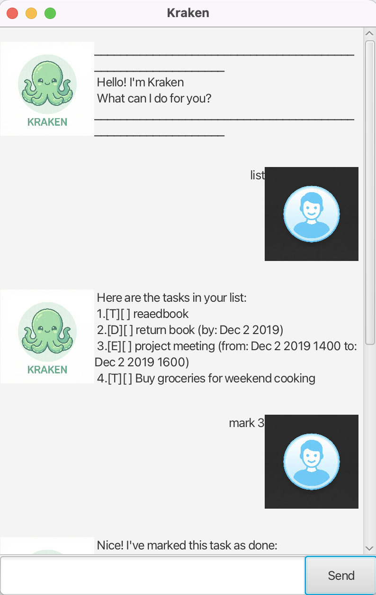

# Kraken User Guide

**Kraken** is a desktop chatbot for managing your tasks. It helps you track todos, deadlines, and events through a chat-style interface. Type your commands in the input box and press Enter (or click Send) to run them.

## Quick start

1. Ensure you have **Java 17** or above installed.
2. Download the latest `kraken.jar` from the release page.
3. The Kraken GUI window will appear with a welcome message.
4. Type your command in the input box and press Enter.

**Example commands to try:**
- `list` : List all your tasks.
- `todo Buy groceries` : Add a simple todo.
- `deadline Submit report /by 2025-02-25 1700` : Add a deadline.
- `bye` : Exit the app.

## Features

### Notes about the command format

- Words in `UPPER_CASE` are parameters you supply. e.g. in `todo DESCRIPTION`, `DESCRIPTION` is the task text.
- Items in square brackets are optional.
- Task numbers (index) in commands refer to the 1-based position shown when you run `list`.
- Some commands have short forms: `todo` (t), `list` (l), `find` (f).

### Adding a todo: `todo`, `t`

Adds a task without a date.

**Format:** `todo DESCRIPTION`

**Example:** `todo Read project documentation`

**Expected outcome:** Kraken confirms the task was added and shows how many tasks you now have.

---

### Adding a deadline: `deadline`

Adds a task that must be done by a specific date/time.

**Format:** `deadline DESCRIPTION /by DATE [TIME]`

**Supported date formats:**
- `yyyy-MM-dd` (e.g., `2025-02-25`)
- `d/M/yyyy` (e.g., `25/2/2025`)
- Add `HHmm` for time in 24-hour format (e.g., `2025-02-25 1700` or `25/2/2025 1700`)

**Examples:**
- `deadline Submit assignment /by 2025-02-28 2359`
- `deadline Pay bills /by 15/3/2025`

**Expected outcome:** Kraken confirms the deadline was added.

---

### Adding an event: `event`

Adds a task with a start and end time.

**Format:** `event DESCRIPTION /from START_DATE_TIME /to END_DATE_TIME`

**Example:** `event Team meeting /from 2025-02-25 1400 /to 2025-02-25 1600`

**Expected outcome:** Kraken confirms the event was added. The start time must be before the end time.

---

### Listing all tasks: `list`, `l`

Shows all tasks and their status (done/not done).

**Format:** `list`

**Expected outcome:** A numbered list of all tasks, with `[T]` (todo), `[D]` (deadline), `[E]` (event), and `[X]` for done or `[ ]` for not done.

---

### Finding tasks: `find`, `f`

Searches for tasks whose description contains the given keyword.

**Format:** `find KEYWORD`

**Example:** `find meeting`

**Expected outcome:** A list of tasks whose descriptions contain the keyword.

---

### Viewing tasks on a date: `on`

Shows deadlines and events on a specific date. Accepts a date only (no time).

**Format:** `on DATE`

**Example:** `on 2025-02-25` or `on 25/2/2025`

**Expected outcome:** A list of tasks that fall on that date (deadlines by that date, events spanning that date).

---

### Marking a task as done: `mark`

Marks a task as completed.

**Format:** `mark INDEX`

**Example:** `mark 2`

**Expected outcome:** The task is marked as done and displayed with `[X]`.

---

### Unmarking a task: `unmark`

Marks a task as not done.

**Format:** `unmark INDEX`

**Example:** `unmark 2`

**Expected outcome:** The task is marked as not done and displayed with `[ ]`.

---

### Deleting a task: `delete`

Removes a task from the list.

**Format:** `delete INDEX`

**Example:** `delete 3`

**Expected outcome:** The task is removed and the task count is updated.

---

### Exiting the program: `bye`

Closes the application.

**Format:** `bye`

**Expected outcome:** Kraken says goodbye and the window closes.

---

## Saving data

Kraken saves your tasks to disk automatically. Data is stored in `data/kraken.txt` and is loaded when you start the app again.

## Command summary

| Action            | Format                                      | Example                                         |
|-------------------|---------------------------------------------|-------------------------------------------------|
| Add todo          | `todo DESCRIPTION`                          | `todo Buy milk`                                 |
| Add deadline      | `deadline DESC /by DATE [TIME]`             | `deadline Submit report /by 2025-02-28 1700`   |
| Add event         | `event DESC /from START /to END`            | `event Meeting /from 2025-02-25 1400 /to 2025-02-25 1600` |
| List tasks        | `list`                                      | `list`                                          |
| Find tasks        | `find KEYWORD`                              | `find meeting`                                  |
| Tasks on date     | `on DATE`                                   | `on 2025-02-25`                                 |
| Mark done         | `mark INDEX`                                | `mark 1`                                          |
| Unmark            | `unmark INDEX`                              | `unmark 1`                                        |
| Delete task       | `delete INDEX`                              | `delete 2`                                        |
| Exit              | `bye`                                       | `bye`                                             |
